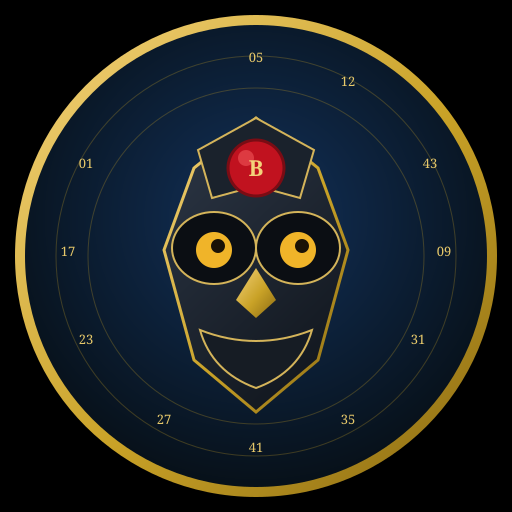

# Baloto Analyst — motor + Grok Bot

<p align="center">
  
</p>

Especialista para [Baloto Colombia](https://baloto.com/). Combina el alcance real de un juego de suerte y azar con analítica descriptiva del histórico: frecuencias, atrasos, pares y generadores de jugadas **aleatorias**, **ponderadas** y **mixtas**.

**Avatar del Bot:** `assets/avatar.jpg` (foto) y `assets/avatar.svg` (vector). En Grok Bot → Edit Profile → subir `assets/avatar.jpg`.

> Cada jugada válida de un sorteo tiene la **misma** probabilidad teórica que las demás de ese sorteo.  
> Este proyecto no predice resultados. Ordena información para jugar con los ojos abiertos.

## Qué incluye

| Pieza | Para qué |
|---|---|
| `docs/GROK_BOT_PROFILE.md` | Perfil listo para pegar en Grok Bot |
| `src/family_engine.py` | Motor unificado: Baloto, Revancha, MiLoto, ColorLoto |
| `src/games.py` | Matrices, precios, días y URLs |
| `scripts/fetch_data.py` | Actualiza los 4 CSV históricos |
| `assets/avatar.jpg` / `assets/avatar.svg` | Avatar del Grok Bot |
| `docs/ALCANCE.md` | Suerte vs datos y juego responsable |

Fuente CSV: [resultadosloteriascol.com](https://resultadosloteriascol.com/) (CC BY 4.0). Contrastar con [baloto.com/resultados](https://baloto.com/resultados).

## Familia de sorteos (no mezclar matrices)

| Juego | Matriz | Días | Precio | Jackpot teórico |
|---|---|---|---|---|
| Baloto | 5 de 43 + Superbalota 1–16 | lun / mié / sáb | $6.000 | 1 en 15.401.568 |
| Revancha | igual que Baloto, sorteo aparte | lun / mié / sáb | +$3.000 sobre Baloto | 1 en 15.401.568 |
| MiLoto | 5 de 39, sin Superbalota | lun / mar / jue / vie | $4.000 | 1 en 575.757 |
| ColorLoto | 6 pares distintos de 42 (6 colores × 1–7) | lun / jue | $5.000 | 1 en 5.245.786 |

Revancha **no se compra sola**: mismos números del tiquete Baloto.

## Uso del motor

```bash
python -m pip install -r requirements.txt
python scripts/fetch_data.py
PYTHONPATH=src python src/family_engine.py --game all --report --n 5
PYTHONPATH=src python src/family_engine.py --game miloto --mode mixto --n 5
PYTHONPATH=src python src/family_engine.py --game colorloto --mode frecuencia --n 3
```

## Cómo crear el Grok Bot

1. App [Grok Bot](https://docs.x.ai/grok-bot/get-started) → Create your own.
2. Nombre `Baloto Analyst`. Sube `assets/avatar.jpg`.
3. Pega `docs/GROK_BOT_PROFILE.md`.
4. Primera tarea: informe + 4 bloques de jugadas, sin entrar a la pasarela de pago.

## Juego responsable

Define un tope semanal. No persigas pérdidas. Premios: 1 año para reclamar. 18+.
